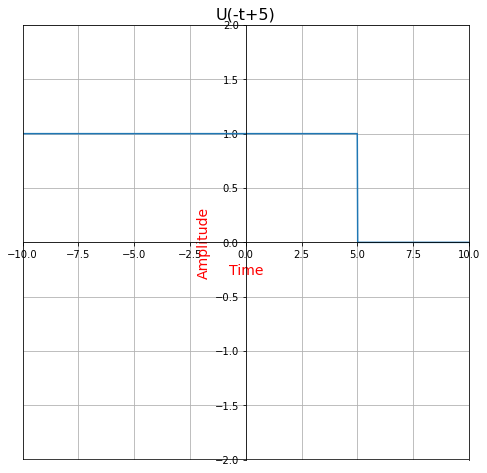
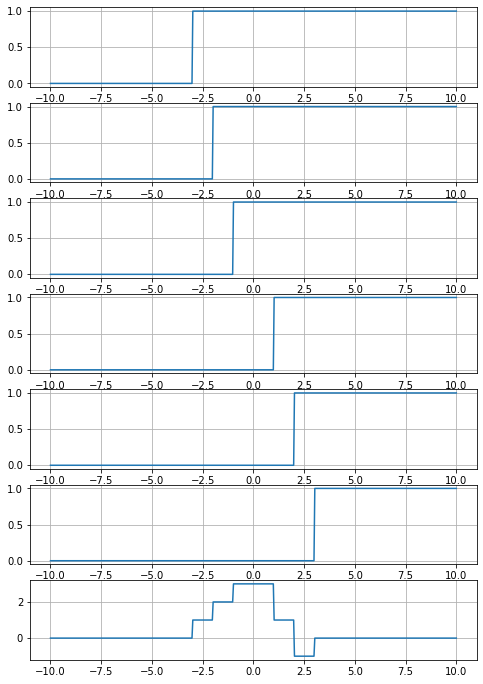

```python
from numpy import*
import numpy as np
import matplotlib.pyplot as plt
%matplotlib inline
import warnings
warnings.filterwarnings("ignore")
```

# U(t),U(t-5),U(t+5) and U(-t),U(-t+5),U(t-5)


```python
def fn_step(t,A,shift):
    u=zeros(N) 
    for i in range(0,N):
        if t[i]>=shift:
            u[i]=A
    return u
```


```python
t=np.linspace(-10,10,1000)
N=len(t)
A=1
shift=0
plt.rcParams['figure.figsize']=(10,10)
u1=fn_step(t,2,-5)
plt.plot(t,u1,"r")
plt.xlim(-10,10);plt.ylim(-3,3);plt.title("U(t)",fontsize=16)
plt.xlabel("Time", fontsize=14);plt.ylabel("Amplitude",fontsize=14)
plt.axes().spines['bottom'].set_position(('data',0.0))
plt.axes().spines['left'].set_position(('data',0.0))
plt.axhline(y=plt.ylim()[0],color='k')
plt.axvline(x=plt.xlim()[0],color='k')
plt.grid()
plt.show()
```


    

    


```python
def fn_Fstep(t,A,shift):
    u=zeros(N) 
    for i in range(0,N):
        if t[i]<=shift:
            u[i]=A
    return u
```


```python
t=np.linspace(-10,10,1000)
N=len(t)
A=1
shift=0
plt.rcParams['figure.figsize']=(8,8)
u1=fn_Fstep(t,1,5)
plt.plot(t,u1)
plt.xlim(-10,10);plt.ylim(-2,2);plt.title("U(-t+5)",fontsize=16)
plt.xlabel("Time",color="r", fontsize=14);plt.ylabel("Amplitude",color="r", fontsize=14)
plt.axes().spines['bottom'].set_position(('data',0.0))
plt.axes().spines['left'].set_position(('data',0.0))
plt.axhline(y=plt.ylim()[0],color='k')
plt.axvline(x=plt.xlim()[0],color='k')
plt.grid()
plt.show()
```


    

    


# Example:Simulate the signal given below using step signals


# x(t)=u(t+3)+u(t+2)+u(t+1)-2u(t-1)-2u(t-2)+u(t+3)

# x(t)=u1+u2+u3-2*u4-2*u5+u6


```python
t=np.linspace(-10,10,500)
N=len(t)
A=1
shift=0


plt.rcParams['figure.figsize']=(8,12)


u1=fn_step(t,1,-3)
plt.subplot(7,1,1)
plt.plot(t,u1)
plt.grid()

u2=fn_step(t,1,-2)
plt.subplot(7,1,2)
plt.plot(t,u2)
plt.grid()

u3=fn_step(t,1,-1)
plt.subplot(7,1,3)
plt.plot(t,u3)
plt.grid()

u4=fn_step(t,1,1)
plt.subplot(7,1,4)
plt.plot(t,u4)
plt.grid()

u5=fn_step(t,1,2)
plt.subplot(7,1,5)
plt.plot(t,u5)
plt.grid()

u6=fn_step(t,1,3)
plt.subplot(7,1,6)
plt.plot(t,u6)
plt.grid()

u7=u1+u2+u3-2*u4-2*u5+u6
plt.subplot(7,1,7)
plt.plot(t,u7)
plt.grid()
plt.show()
```


    

    

