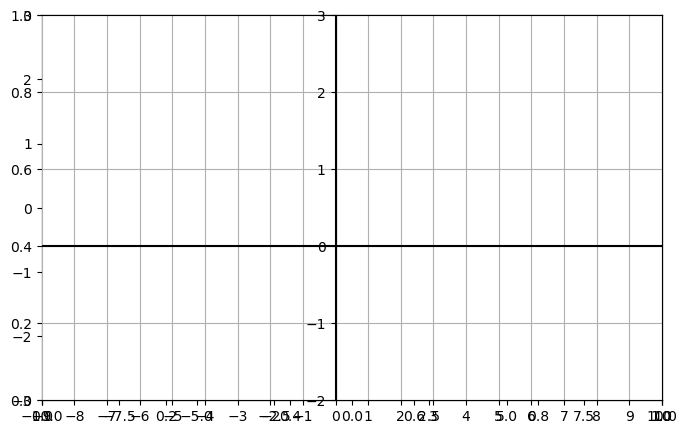
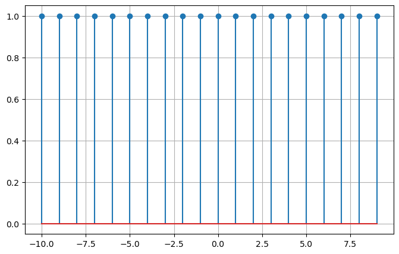

```python
from numpy import*
import matplotlib.pyplot as plt
%matplotlib inline
import warnings
warnings.filterwarnings("ignore")
```

# U(n),U(n-3),U(n+3)  


```python
def fn_step(n,A,shift):
    u=zeros(N) 
    for i in range(0,N):
        if n[i]>=shift:
            u[i]=A
    return u
```


```python
n=arange(-10,10)
N=len(n)
A=1
shift=-3

plt.rcParams['figure.figsize']=(8,5)

u1=fn_step(n,1,0)
u2=fn_step(n,1,6)
u3=fn_step(n,1,7)
u4=u2-u3

plt.stem(n,u1)

plt.xlim(-10,10);plt.ylim(-3,3)

plt.axes().spines['bottom'].set_position(('data',0.0))
plt.axes().spines['left'].set_position(('data',0.0))
plt.axhline(y=plt.ylim()[0],color='k')
plt.axvline(x=plt.xlim()[0],color='k')

x_position=list(range(-10,10));y_position=list(range(-3,3))
plt.xticks([i+1 for i in x_position]);plt.yticks([i+1 for i in y_position])

plt.grid()
```


    

    


# Folded DT Step:U(-n),U(-n+3),U(n-3)


```python
def fn_Fstep(n,A,shift):
    u=zeros(N) 
    for i in range(0,N):
        if n[i]<=shift:
            u[i]=A
    return u
```


```python
n=arange(-10,10)
N=len(n)
A=1
shift=-3
u=fn_Fstep(n,1,-1)

plt.rcParams['figure.figsize']=(8,5)
plt.stem(n,u,use_line_collection=True)
plt.xlim(-10,10);plt.ylim(-3,3)
plt.axes().spines['bottom'].set_position(('data',0.0))
plt.axes().spines['left'].set_position(('data',0.0))
plt.axhline(y=plt.ylim()[0],color='k')
plt.axvline(x=plt.xlim()[0],color='k')
x_position=list(range(-10,10));y_position=list(range(-3,3))
plt.xticks([i+1 for i in x_position]);plt.yticks([i+1 for i in y_position])
plt.grid()
```


    

    


```python
g=u+u1
plt.stem(n,g)
plt.grid()
```


    

    

